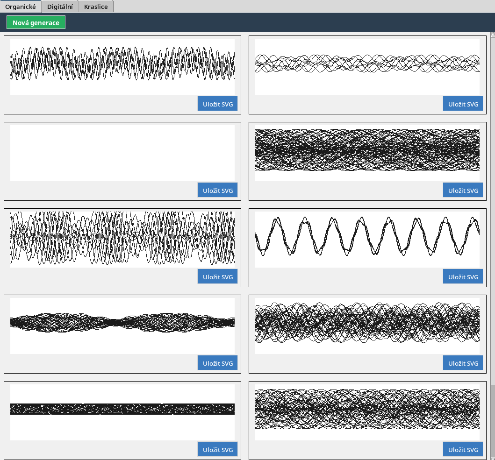

# Signal Generator for EggBot

> **Inspired by [GA_eggbot](https://github.com/davidbliss/GA_eggbot) by David Bliss** — this application is a modification and Python port of that project.

A tool for generating organic, digital, and kraslice patterns for the [EggBot](http://egg-bot.com/) plotter. Output is SVG files at 3200 × 800 px with named Inkscape-compatible layers.



## Running

```bash
python app.py
```

No external dependencies — uses only Python stdlib (tkinter, math, random).

## Tabs

### Organic

Wave curves generated by combining sine functions with amplitude modulation. Each individual has 8 parameters that determine the wave shape (wavelength, amplitude, modulation). Curves wrap across the canvas width and overlap — the resulting pattern resembles organic textures.

### Kraslice

Traditional geometric patterns inspired by Czech and Slovak Easter egg painting:

| Type | Description |
|------|-------------|
| **zigzag** | Horizontal bands of alternating zigzag lines |
| **diamond** | Diamond lattice (two families of diagonal lines) |
| **waves** | Parallel horizontal sine waves |
| **chevron** | Asymmetric V-shapes (arrows) arranged in bands |
| **crosshatch** | Horizontal waves crossed with diagonal waves |

### Digital

Clean digital waveforms in five variants:

| Type | Description |
|------|-------------|
| **square** | Square wave with adjustable duty cycle |
| **sawtooth** | Sawtooth wave (linear ramp) |
| **triangle** | Triangle wave |
| **pcm** | Random binary pattern (PCM data appearance) |
| **staircase** | Staircase wave with N levels |

## Controls

- **New Generation** — generates a new set of random patterns
- **Save SVG** — saves the pattern to the `svg/` folder as `organic_XXXX.svg`, `digital_XXXX.svg`, or `kraslice_XXXX.svg`
- **q + Enter** in the terminal — quits the application

## SVG Output

- Dimensions: 3200 × 800 px
- 9 named layers (`1_Layer`–`9_Layer`) compatible with Inkscape and the Axidraw/EggBot extension
- Curves are in `1_Layer`, remaining layers are empty for manually assigning pen colours
- Waves start and end at the same y position — seamless printing on an egg

## Project Structure

```
app.py                  main application (Organic / Digital / Kraslice tabs)
individual.py           organic individual — wave algorithm
generation.py           organic population management
digital_individual.py   digital individual — signal types
digital_tab.py          GUI tab for digital signals
kraslice_individual.py  kraslice individual — geometric patterns
kraslice_tab.py         GUI tab for kraslice patterns
svg_renderer.py         SVG export
src/ga_eggbot/          original reference implementation in Processing
```
